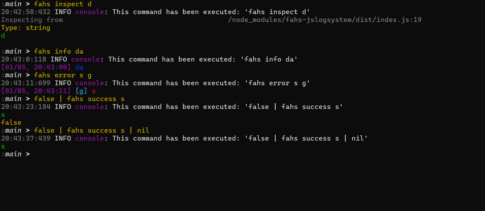

# FAHS-JSLOGSYSTEM

A package used to add the functionality of fahs into a simple command available to use in jslogsystem.

## what it gives us

The package exports two things:
* commandTable (also as FAHS_LOGSYSTEM_COMMANDTABLE) -> a command Table with commands
* commandCompounds (also as FAHS_LOGSYSTEM_COMMANDCOMPOUNDS) -> command compounds (it's a similar but different format from commandTable)


## how to use it

The shortest fully functioning code is:
```js
import {allGroup_collection, quickSetup} from "jslogsystem";
import {FAHS_LOGSYSTEM_COMMANDTABLE} from "fahs-jslogsystem";
 
quickSetup({
    commandTable: allGroup_collection.copy().extend(FAHS_LOGSYSTEM_COMMANDTABLE),
    addToGlobalAs: ['console'],
    useAddToGlobalAs: true
});
```
It adds every command and includes added from that package


It's recommended to have 'console' in addToGlobalAs and useAddToGlobalAs as fahs package uses internally node js console global object.

You can also use FAHS_LOGSYSTEM_COMMANDTABLE alone, but it's not recommended as fahs commands alone are hard to use.

## how does it work?

It adds "fahs" command consisting of several subcommands:
* fahs inspect <...data> -> it will inspect the data
* fahs info <msg> [<labelOrOptions>] -> it behaves like console.info
* fahs warn <msg> [<labelOrOptions>] -> it behaves like console.warn
* fahs error <msg> [<labelOrOptions>] -> it behaves like console.error
* fahs success <msg> [<labelOrOptions>] -> it behaves like console.info but with success

all of those commands are bound to corresponding functions in fahs

labelOrOptions accepts:
* string -> if you want a label
* nothing -> if you don't want anything
* true -> if you want to display a timestamp
* false -> if you don't want to display a timestamp
* object { label, showTimestamp } where label is a label and showTimestamp is a boolean that says whether to display a timestamp

You can create objects using built-in jslogsystem 'json' command.
You can create booleans using either 'true' or 'false' built-in jslogsystem commands

## photos

